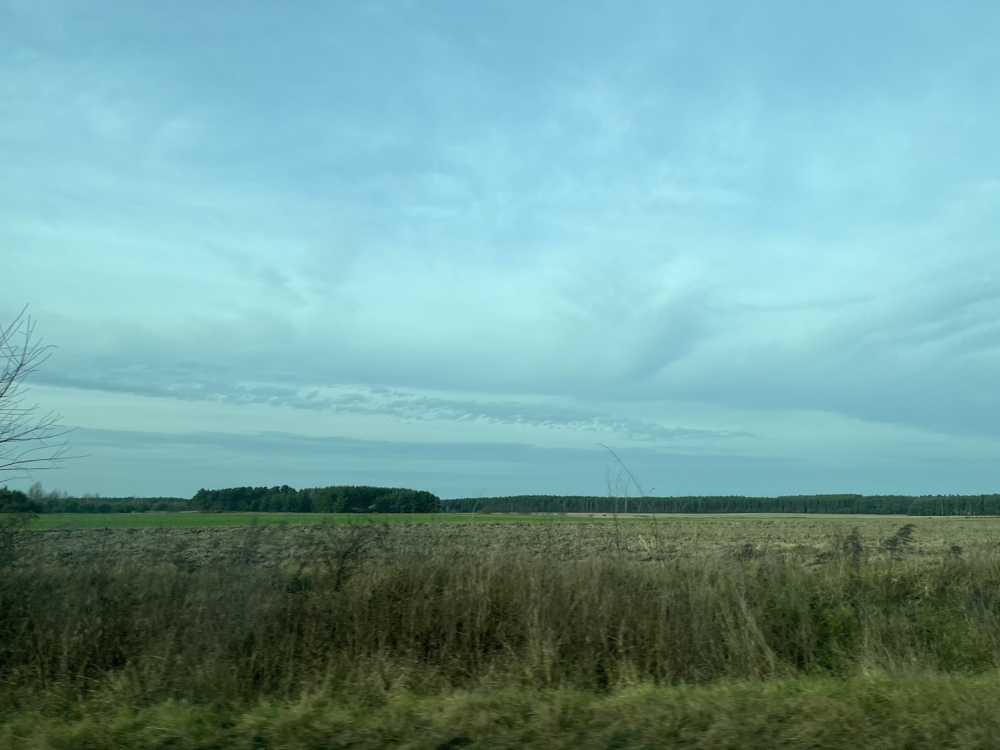
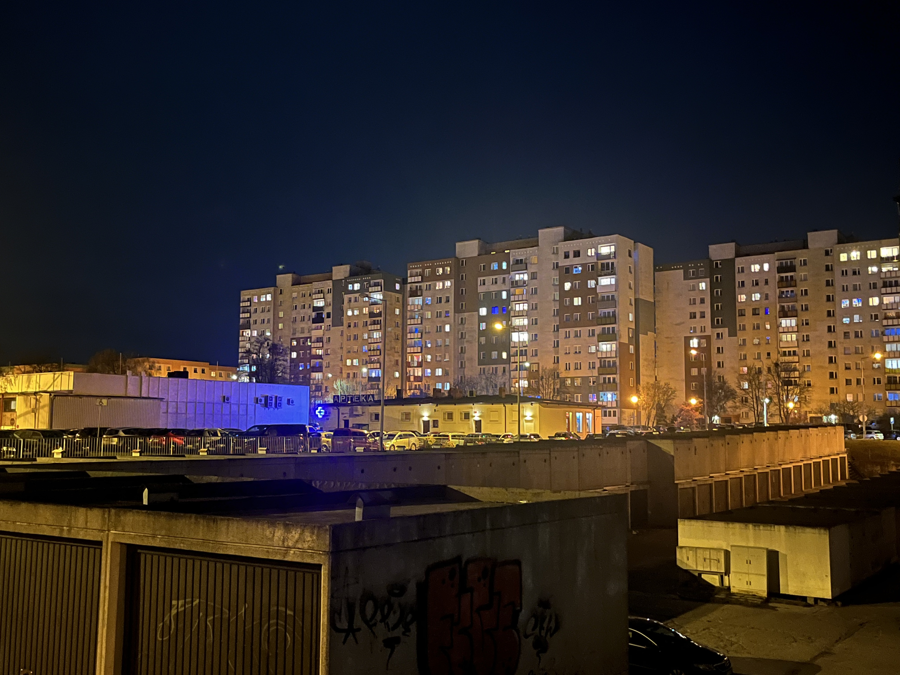
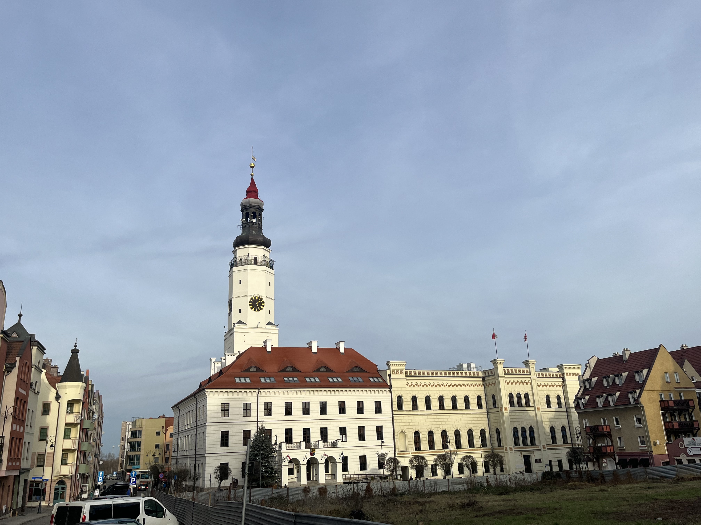

# Getting temperature data

## Task 1 

**Choose a location of interest and find the 25 closest weather stations using the handle_gsod function**

>
I have decided to conduct a phonology analysis at a location in Poland. The city of Glogau, situated on the banks of the Oder, was chosen as the starting point. For more information about the location, the following website can be visited [here](https://de.wikipedia.org/wiki/G%C5%82og%C3%B3w).
The climate at the location is relatively similar to Bonn, although the climate is generally more continental, which can be reflected in colder winters and drier, slightly warmer summers.
Here is a picture of a typical landscape in Lower Silesia in Poland.

<div style="display: flex; justify-content: space-between;">
  
</div>

>
Beautiful Glogau City

<div style="display: flex; justify-content: space-between;">
  
</div>

>
Ok, here really beautiful old city of Glogau

<div style="display: flex; justify-content: space-between;">
  
</div>

```{r, echo= TRUE}
# station_list_poland = handle_gsod(action="list_stations",
#                            location=c(16.5,51.39),
#                            time_interval=c(1990,2020))
# kable(station_list_poland[1:10,]) %>% kable_styling("striped", position = "left", font_size = 10)

# write.csv(station_list_poland,"weather_data/Poland_station_list.csv",row.names=FALSE)

list_poland_weather = read.table("weather_data/Poland_station_list.csv", header = TRUE, sep=",")
kable(list_poland_weather[1:10,], caption = "Station List") %>% 
  kable_styling("striped", position = "left", font_size = 10)%>%
  scroll_box(width = "100%")
```


## Task 2

**Download weather data for the most promising station on the list**

>
The most promising station for obtaining continuous weather recording is represented by the weather station in Leszno, located approximately 50 kilometers (by air) from Glogau. This location is listed as the seventh entry in the "Station List" table.
>
To avoid constantly loading the weather data, it is stored in the `weather_poland_leszno` variable. The file is then saved as a CSV and read in using the `read.table()` function.


```{r, echo = TRUE, message=FALSE, warning=FALSE}
# weather_poland_leszno <- handle_gsod(
#   action = "download_weather",
#   location = station_list_poland$chillR_code[7],
#   time_interval = c(1990, 2020))


# kable(weather_poland_leszno[[1]][[2]][1:10, ]) %>%
#   kable_styling("striped", position = "left", font_size = 10)

#write.csv(weather_poland_leszno[[1]][[2]],"weather_data/Poland_leszno_weather.csv",row.names=FALSE)

weather_poland_leszno_place = 
  read.table("weather_data/Poland_leszno_weather.csv", header = TRUE, sep=",")

kable(weather_poland_leszno_place[1:10, ], caption = "Weather Data Leszno ") %>%
   kable_styling("striped", position = "left", font_size = 10)%>%
   scroll_box(width = "100%")

```

## Task 3

**Convert the weather data into chillR format**

```{r}
# weather_pl <- weather_poland_leszno$LESZNO[[2]]
# cleaned_weather_pl <- handle_gsod(weather_pl)

# kable(cleaned_weather_pl[1:20,]) %>%
#   kable_styling("striped", position = "left", font_size = 10)

#write.csv(cleaned_weather_pl,"weather_data/Poland_leszno_chillR_weather.csv",row.names=FALSE)

cleaned_weather_pl_leszno = read.table("weather_data/Poland_leszno_chillR_weather.csv", header = TRUE, sep = ",")

kable(cleaned_weather_pl_leszno[1:10, ], caption = "Cleaned Weather Data Leszno") %>%
   kable_styling("striped", position = "left", font_size = 10)
```


