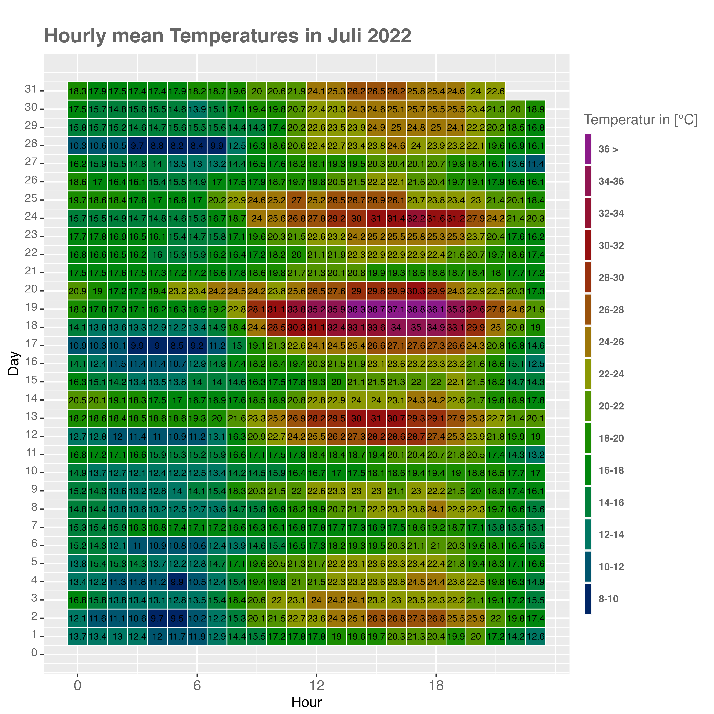

# Heatmaps 

## make_classes() - Function 

```{r, echo = FALSE, warning=FALSE, message=FALSE}
library(tidyverse)
library(lubridate)
library(reshape2)
library(dplyr)
library(ggplot2)
library(colorRamps)
library(tibble)

```

>
In the previous lecture, the concept of chill and the expected changes were effectively demonstrated using heatmaps. In this chapter, this visualization method is utilized to depict the temperature measurements taken in July 2022 at the weather station in Zülpich-Fuessenich. Preprocessing is necessary for this purpose. One challenge involves categorizing the temperatures into classes. To gain an understanding of how the classes can be set within the temperature data, one can initially use the `make_classes` function to get an overview.


```{r, echo = TRUE}
make_classes <- function(data, scale_) {
  data <- as_tibble(data)
  min = min(data) - 1
  max = max(data)
  sacle = scale_
  end = round(((max - min) / sacle))
  
  data[, "class"] <- NA
  
  for (i in seq(1, nrow(data[, 1]))) {
    for (j in seq(0, (end - 1))) {
      if (data[, 1][i,] > (min + end * sacle)) {
        data[, "class"][i,] =  paste((min + end * sacle)," >")
        break
      }
      
      if (data[, 1][i,] >= (min + (j * sacle))  &&
          data[, 1][i,] <= ((min + sacle) + (j * sacle))) {
        data[, "class"][i,] = paste((min + (j * sacle)),"-",
                                    ((min + sacle) + (j * sacle)))
        break
      }
    }
  }
  return(list(data, 
              unique(data[,"class"]),
              table(data[,"class"])))
}
```

>
First let's load some Data

```{r, echo = TRUE, message=FALSE, warning=FALSE}

weather_fue <- read_delim("/Users/Phil/Documents/Auswertung_Manuel_Juli_22/temp_hum_pres08.08.22.csv")

mod_weather_fue <-
  weather_fue %>% filter("2022-07-01 00:00:00" < date) %>%
  filter("2022-08-01 00:00:00" > date) %>%
  select(temperature, period, type, date, sensor) %>%
  filter(period == 1, type == 0, sensor == 0)
```

>
The function `make_classes()` is not part of the `chillR` package, and has thus been implemented here. It does not accept any data field as input. The temperatures must be passed directly, similar to the `max()` function, which is implemented by default in R. The `scale_` argument must be used to specify the class width. A small demonstration of the function will be shown below.
>
The function returns a list with multiple elements. The first list entry simply returns all the formed classes. The second entry provides an overview of the classes that were used. The third entry shows how frequently each class is represented.


```{r, echo = TRUE}
df = mod_weather_fue
df[, "class"] = make_classes(df$temperature, scale_ = 2)[[1]][, 2]

kable(df[1:30,], caption = "Dataset Weather Fuessenich with Classes")  %>%
  kable_styling("striped", position = "left",font_size = 10)%>%
  scroll_box(width = "100%")
```

>
In this case, a new column named `class` is first written in the dataframe `df`. The generated classes are then directly written into this column. The formed classes can now be read in the table "Dataset Weather Fuessenich with Classes" in the `class` column.
>
>
At this point, it must be noted that the current approach is for orientational purposes only. In this particular case, the class boundaries will be manually generated at a later time using the `mutate()` function from the `tidyverse` package. The overall goal is to later provide a function that integrates the `make_classes()` function and automatically creates a heatmap that can be dynamically modified.

## Create Heatmap

```{r, echo = TRUE, message=FALSE, warning=FALSE}
# preprocessing 

# create column with date
mod_weather_fue[,"date_new"] = 
  as.POSIXct(mod_weather_fue$date, format ="%m/%d/%Y %H:%M:%S" )

# separate hours (time)
mod_weather_fue[, "hours"] =
  format(mod_weather_fue$date_new, format = "%H:%M:%S")

# pick only hours
mod_weather_fue[, "hours_only"] = 
  as.numeric(substr(mod_weather_fue$hours, 1, 2))

# delete first row (individual fix)
mod_weather_fue = mod_weather_fue[-c(1), ]

# pick day 
mod_weather_fue[, "Tag"] =
  as.numeric(substr(mod_weather_fue$date, 9, 10))

# set new col Index with NA 
mod_weather_fue[,"Index"] <- NA

m3 <- mod_weather_fue

m3[,"countfactor"] <- NA

m1 <-m3 %>%
  mutate(Index=factor(Index, levels=rev(sort(unique(Index)))))%>%
  mutate(countfactor=cut(temperature, breaks=c(8, 10, 12, 14, 16, 18, 20, 22,
                                         24,26,28,30,32,34,36, max(temperature, na.rm=TRUE)),
                         labels=c("8-10", "10-12", "12-14", "14-16", "16-18", "18-20",
                                  "20-22","22-24","24-26","26-28","28-30",
                                  "30-32","32-34","34-36","36 >")))%>%
mutate(countfactor=factor(as.character(countfactor), levels=rev(levels(countfactor))))


colors <- c("#002565", "#00556E", "#007763",
            "#007F3A", "#00860D","#198C00","#519300","#8B9803","#9D7608","#9A520B","#98300D","#951010","#931231","#901551","#8B1A89")
textcol <- "grey40"


ggplot(m1, aes(x=hours_only , y=Tag, fill=countfactor ))+
  geom_tile(colour="white", size=0.3)+
  geom_text(aes(label=round(temperature, digits = 1)), size=2.3)+
  scale_fill_manual(values=rev(colors), na.value = "grey90")+
  guides(fill=guide_legend(title="Temperatur in [°C]"))+
  theme_grey(base_size=10)+
  labs(x = "Hour", y = "Day")+
  ggtitle("Hourly mean Temperatures in Juli 2022")+
  theme(legend.position="bottom", legend.direction="horizontal",
        legend.title=element_text(colour=textcol),
        legend.margin=margin(grid::unit(0, "cm")),
        legend.text=element_text(colour=textcol, size=7, face="bold"),
        legend.key.height=grid::unit(0.8, "cm"),
        legend.key.width=grid::unit(0.2, "cm"),
        axis.text.x=element_text(size=10, colour=textcol),
        axis.text.y=element_text(vjust=0.2, colour=textcol),
        axis.ticks=element_line(size=0.4),
        plot.background=element_blank(),
        panel.border=element_blank(),
        plot.margin=margin(0.7, 0.4, 0.1, 0.2, "cm"),
        plot.title=element_text(colour=textcol, hjust=0, size=14, face="bold")
  )+
  scale_x_continuous(breaks = seq(from = 0, to = 23, by = 6))+
  scale_y_continuous(breaks = seq(0,31,1))
```

>
As seen, it can be somewhat tricky to save the final map in a suitable format. Therefore, the entire map was saved once, and the result was read in as a whole to maintain readability.


<div style="display: flex; justify-content: space-between;">
  
</div>


