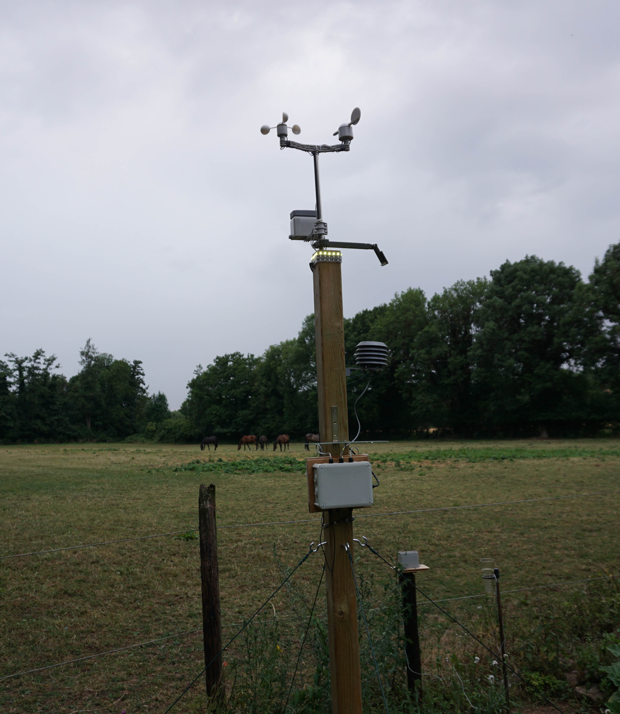

# Making hourly temperatures 

## Task 1

**Choose a location of interest, find out its latitude and produce plots of daily sunrise, sunset and daylength**

>
First, I would like to compare the lengths of days among locations of interest. I have selected Glogau in Poland, Zülpich in Germany, Tenerife in Spain, Moscow in Russia, and Karkaralinsk in Kazakhstan.


```{r, echo= TRUE, message=FALSE, warning=FALSE}

# initialize the variables with daylength, sunrise and sunset by the function daylength
Glogau      <- daylength(latitude = 51.40, JDay = 1:365)
Teneriffa   <- daylength(latitude = 28.19, JDay = 1:365)
Zuelpich    <- daylength(latitude = 50.42, JDay = 1:365)
Moskau      <- daylength(latitude = 55.45, JDay = 1:365)
Karkaralinsk <- daylength(latitude = 49.24, JDay = 1:365)

# Create a dataframe consisting of the variables "base" (days 1 to 365) and the
# respective locations and containing only the day length for each location.
df <- data.frame(
  base         = seq(length(Glogau[[1]])),
  Glogau       = Glogau[[3]],
  Teneriffa    = Teneriffa[[3]],
  Zülpich      = Zuelpich[[3]],
  Moskau       = Moskau[[3]],
  Karkaralinsk = Karkaralinsk[[3]]
)


kable(head(df), caption = "Differnt Locations") %>% 
       kable_styling("striped", position = "left", font_size = 10)%>%
        scroll_box(width = "100%")

# create a pivot table
df_long <-
  pivot_longer(df, -"base", names_to = "Location", values_to = "daylength")

kable(head(df_long)) %>% 
      kable_styling("striped", position = "left", font_size = 10)%>%
      scroll_box(width = "100%")


# plot the result with ggplot
ggplot(df_long, aes(x = base, y = daylength, groupe = Location)) +
  geom_line(aes(color = Location), lwd = 1.0) +
  ggtitle("Different day lengths in different places") +
  labs(x = "Days", y = "Daylength [h]") + theme_gray(base_size = 15)

```

>
Create a summary of the sunrise, sunset, and day length for Moscow.

```{r, echo= TRUE, warning=FALSE, message=FALSE}

Days <- daylength(latitude = 55.45, JDay = 1:365)

Days_df <-
  data.frame(
    JDay = 1:365,
    Sunrise = Days$Sunrise,
    Sunset = Days$Sunset,
    Daylength = Days$Daylength
  )

Days_df<-melt(Days_df, id=c("JDay")) 
```

>
Show the final result

```{r, echo=TRUE, warning=FALSE, out.width="80%"}
ggplot(Days_df, aes(x = JDay, y = value)) + geom_line(lwd = 1.5, color = "red") + facet_grid(cols = vars(variable)) +
  ylab("Time of Day / Daylength (Hours)") + theme_bw(base_size = 20) +
  ggtitle("Sunrise, Sunset and Daylength of Moskau")

```

## Task 2


**Produce an hourly dataset, based on idealized daily curves, for the KA_weather dataset (included in chillR)**

>
The following two tasks were performed in a modified form. In order to demonstrate the application of the chillR package, it was decided to use a currently active weather station and use its data as a basis. Data on the weather station can be found in the table below. Here is a picture of the weather station:




```{r, echo=FALSE}
location = data.frame(
  Location = c("Zuelpich - Fuessenich"),
  State = c("North Rhine-Westphalia"),
  GPS = c("50.69527026369208, 6.615666577711913"),
  Gauß_Krüger = c("Rechtswert:2543500 Hochwert: 5617798")
)


kable(location, caption = "Weather Station Fuessenich")%>%
        kable_styling("striped", position = "left", font_size = 10)%>%
        scroll_box(width = "100%")

```

First, corresponding data must be read in. The data are already prepared.

```{r, echo =TRUE}
Zuelpich_hourly = read.table(
  "weather_data/Weather_Zuelpich_2019_hourly.csv",
  header = TRUE,
  sep = ","
)

Zuelpich_min_max = read.table("weather_data/Weather_Zuelpich_2019.csv",
                              header = TRUE,
                              sep = ",")

```

```{r, echo=FALSE, message=FALSE, warning=FALSE}
library(lubridate)
```


```{r,echo=TRUE}
zuelpich_april = Zuelpich_hourly %>% filter("2019-04-01 00:00:00" < date) %>%
  filter("2019-04-05 00:00:00" > date)

zuelpich_april$date_new <- as.POSIXct(zuelpich_april[, 3])
zuelpich_april$date_newnew = as.Date(zuelpich_april[, 3])

kable(head(zuelpich_april), caption = "Dataset: zuelpich_april") %>%
        kable_styling("striped", position = "left", font_size = 10)%>%
       scroll_box(width = "100%")

```

>
Next, the lows and highs for the corresponding days must be determined from the data set containing hourly data. 


```{r,echo=TRUE}
final <- zuelpich_april %>%
  group_by(Tag = day(date_newnew)) %>%
  summarise(
    Mittel =  round(mean(temperature, na.rm = TRUE), digits = 1),
    Tmax = max(temperature),
    Tmin = min(temperature)
  )

kable(final, caption = "Dataset:Tmean Tmax Tmin")%>%
        kable_styling("striped", position = "left", font_size = 10)%>%
        scroll_box(width = "100%")
```

>
Next, the dataset containing hourly temperature values must be extended with a column that will later represent the daily high and low values. First, the new column `Tmax_Tmin` is filled with `NAs`. Then the maximum and minimum values are taken from the previously generated dataset `final`. These values are compared with the hourly values. If they match, the maximum or minimum value found is written to the previously created column `Tmax_Tmin`. In this way, the daily maximum and minimum values are placed in the table `zuelpich_april` at the same place where they were also measured.


```{r, echo=TRUE}
# generate new coloumn with NAs 
zuelpich_april$Tmax_Tmin = NA

# match Tmin
for (i in seq(1, nrow(zuelpich_april))) {
  for (j in seq(1, nrow(final))) {
    if (zuelpich_april$temperature[i] == final$Tmax[j]) {
      zuelpich_april$Tmax_Tmin[i] <- final$Tmax[j]
    }
  }
}

# match Tmax 
for(i in seq(1, nrow(zuelpich_april))) {
  for (j in seq(1, nrow(final))) {
    if (zuelpich_april$temperature[i] == final$Tmin[j]) {
      zuelpich_april$Tmax_Tmin[i] <- final$Tmin[j]
    }
  }
}


kable(zuelpich_april[1:25,], caption = "Dataset: TmaxTminMatch")%>% 
        kable_styling("striped", position = "left", font_size = 10)%>%
        scroll_box(width = "100%")
```
>
After creating a new column containing only the `Tmax` and `Tmin` temperatures, a plot can be created that shows the measured temperature history and includes information on `Tmax` and `Tmin`. The red dots symbolize the daily temperature values for `Tmax` and `Tmin`, respectively.


```{r,echo=TRUE, warning=FALSE, message=FALSE}

ggplot(data = zuelpich_april, aes(x = zuelpich_april[, 4], y = zuelpich_april[, 2])) +
  geom_line(size = 1.0, colour = "darkgreen") +
  geom_point(aes(y = zuelpich_april$Tmax_Tmin),
             colour = "red",
             size = 3.0) +
  labs(x = "Date", y = "Temperature (C°)") +
  ggtitle("1 to 5 April 2019 weather station Zuelpich") +
  theme_bw(base_size = 13)

```

>
First, the dataset `ZU_weather` must be created. The columns `DATE`, `Year`, `Month`, `Day`, `Tcontinue`, and `Temp_inter` are created. The `Temp_inter` column contains temperature data with large gaps that must be interpolated between.

```{r, echo = TRUE}
ZU_weather = data.frame(
  DATE = zuelpich_april[, 4],
  Year = as.numeric(substr(zuelpich_april[, 4], 1, 4)),
  Month = as.numeric(substr(zuelpich_april[, 4], 6, 7)),
  Day = as.numeric(substr(zuelpich_april[, 4], 9, 10)),
  Tcontinue = zuelpich_april[, 2],
  Temp_inter = zuelpich_april[, 6]
)

kable(ZU_weather[1:8,])%>% 
        kable_styling("striped", position = "left", font_size = 10)%>%
      scroll_box(width = "100%")
```
>
The next step is to use the `interpolate_gaps()` function to calculate the missing temperatures between `Tmax` and `Tmin`. The function `interpolate_gaps()` returns a list with two entries. The first entry of the list contains the interpolated values, which can be accessed using `$interp` or `[[1]]`. The second entry, `$missing`, gives information on whether a value needs to be interpolated or if a real value is present. The function `interpolate_gaps()` linearly interpolates between gaps in the temperature records. The interpolated values are written directly to the Temp_inter column using the first list entry created by the `interpolate_gaps()` function.


```{r, echo=TRUE}

# interpolate between gaps in coloum Temp_inter 
ZU_weather$Temp_inter <- interpolate_gaps(ZU_weather$Temp_inter)[[1]]

# have a look at the first 10 entries
kable(ZU_weather[1:10, ]) %>% 
        kable_styling("striped", position = "left", font_size = 10)%>%
        scroll_box(width = "100%")

```

>
Thus, all gaps in the column `Temp_inter` are filled by linear interpolation. The interpolation is performed between the gaps.
>
The non-linear interpolation method considers the sun's position at the respective location in the interpolation. In addition, the `stack_hourly_temps()` function requires a dataset as input that only contains `Tmax` and `Tmin` values. In this example, this dataset is called `ZU_weather_min_max` and consists of five columns: `Year`, `Month`, `Day`, `Tmax`, and `Tmin`.


```{r, echo = TRUE}
# create dataframe for non-linear interpolation
ZU_weather_min_max = data.frame(
  Year = as.numeric(substr(Zuelpich_min_max[, 2], 1, 4)),
  Month = as.numeric(substr(Zuelpich_min_max[, 2], 6, 7)),
  Day = as.numeric(substr(Zuelpich_min_max[, 2], 9, 10)),
  Tmax = final[, 3],
  Tmin = final[, 4]
)
kable(ZU_weather_min_max[1:10,])%>%
      kable_styling("striped", position = "left", font_size = 10)%>%
      scroll_box(width = "100%")
```


>
The function `stack_hourly_temps()` can be passed the entire dataset `ZU_weather_min_max`. This function sets the `Tmax` values to 6:00 PM and the Tmin values to 6:00 AM, without performing any interpolation between the times when the `Tmax` and `Tmin` values actually occurred. The resulting interpolation is written to a new dataset, `ZU_hourly`. A new column called `DATE` is then created in this dataset to store the date, and the first row is removed due to an index shift.


```{r, echo=TRUE}
ZU_hourly = stack_hourly_temps(ZU_weather_min_max, latitude = 50.4)

ZU_hourly$hourtemps[, "DATE"] =
  ISOdate(
    ZU_hourly$hourtemps$Year,
    ZU_hourly$hourtemps$Month,
    ZU_hourly$hourtemps$Day,
    ZU_hourly$hourtemps$Hour
  )

ZU_hourly_mod = ZU_hourly[[1]][-1, ]

kable(ZU_hourly_mod[1:10,])%>% 
      kable_styling("striped", position = "left", font_size = 10)%>%
      scroll_box(width = "100%")
```

>
Finally, a dataset is generated containing the actual measured temperature data, as well as the interpolated values calculated using both linear and non-linear interpolation. The results can be effectively visualized in a plot.


```{r, echo = TRUE, message=FALSE, warning= FALSE}
# final_df = data.frame(
#   DATE = zuelpich_april[, 4],
#   Measured_Temp = zuelpich_april[, 2],
#   Linear_Interp  = ZU_weather[, 6],
#   Non_Linear_Interp = ZU_hourly_mod[, 8]
# )
#write.csv(final_df, "weather_data/final_df_non_linear.csv")

# read final dataframe
final_df_m = read.table("weather_data/final_df_non_linear.csv",
                        header = TRUE,
                        sep = ",")

#remove index
final_df_mx = final_df_m[, -1]

#generate Date
final_df_mx$DATE =  as.POSIXct(final_df_mx$DATE)

#create pivot table
final_df_mod  = pivot_longer(final_df_mx,
                             -"DATE",
                             names_to = "Method",
                             values_to = "Temperature")

#plot final result and compare methods
ggplot(data = final_df_mod, aes(x = DATE, y = Temperature
                                , colour = Method)) +
  geom_line(lwd = 1.3) +
  labs(x = "Date", y = "Temperature (C°)") +
  ggtitle("1 to 5 April 2019  Zuelpich") +
  scale_color_manual(values = c("red", "darkgreen", "darkblue")) +
  #facet_wrap(vars(Method)) +
  theme_bw(base_size = 15)

```


