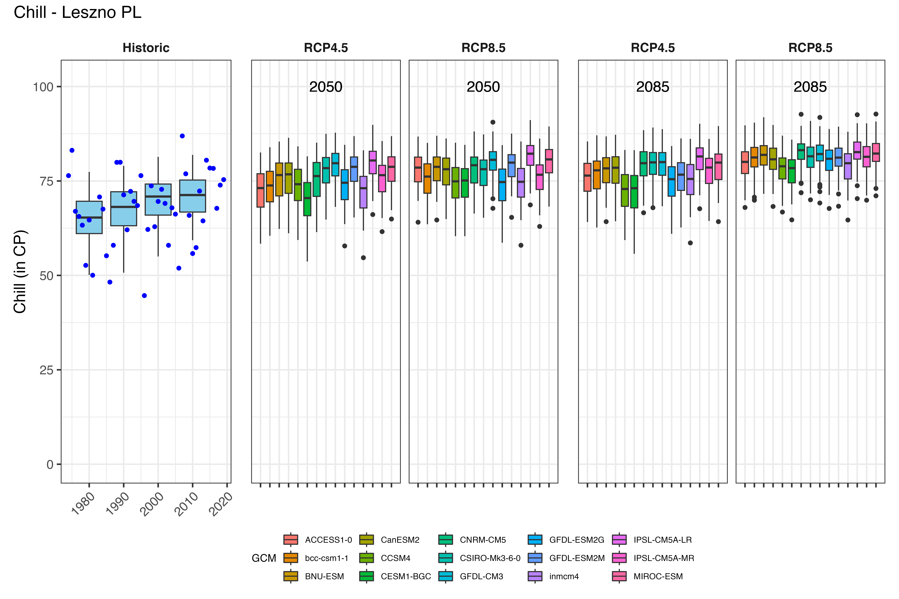
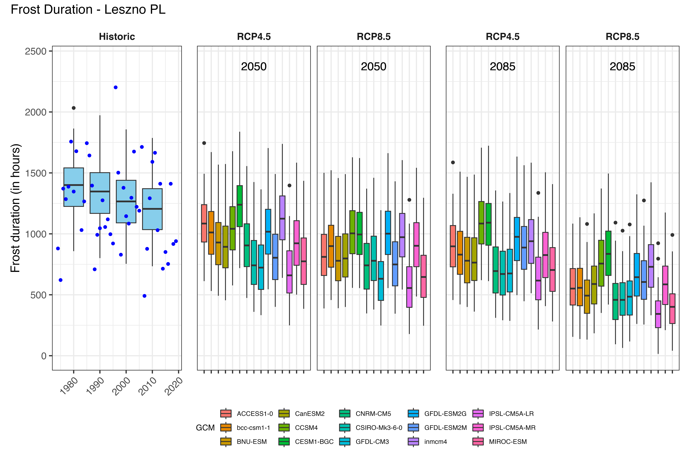

# Plotting Future Scenarios

## Task 1

**Produce similar plots for the weather station you selected for earlier exercises.**

>
In order to plot the results of the future scenarios, the `ggpmisc` and `patchwork` 
packages must first be loaded.

```{r, echo =TRUE, warning=FALSE, message=FALSE}
library(patchwork)
library(ggpmisc)
```

>
In the following, the data about possible future scenarios are visualized with `ggplot`.


```{r, echo=TRUE, warning=FALSE}

for(nam in names(chills[[1]]$data))
  {
   # Extract the data frame.
   ch<-chills[[1]]$data[[nam]]
   # Add columns for the new information we have to add and fill them.
   ch[,"GCM"]<-"none"
   ch[,"RCP"]<-"none"
   ch[,"Year"]<-as.numeric(nam)
   
   # Now check if this is the first time we've gone through this loop.
   # If this is the first time, the ch data.frame becomes the output
   # object (past_simulated).
   # If it is not the first time ('else'), we add the current data.frame
   # to the 'past_simulated' object
  if(nam==names(chills[[1]]$data)[1])
    past_simulated<-ch else
      past_simulated<-rbind(past_simulated,ch)
  }

past_simulated["Scenario"] = "Historic"

kable(past_simulated[1:5,])  %>%
  kable_styling("striped", position = "left",font_size = 8)%>%
  scroll_box(width = "100%")

past_observed = chills[[1]][["historic_data"]]

kable(past_observed[1:5,])  %>%
  kable_styling("striped", position = "left",font_size = 8)%>%
  scroll_box(width = "100%")

# Extract future data
for(i in 2:length(chills))
  for(nam in names(chills[[i]]$data))
    {ch<-chills[[i]]$data[[nam]]
     ch[,"GCM"]<-nam
     ch[,"RCP"]<-chills[[i]]$caption[1]
     ch[,"Year"]<-chills[[i]]$caption[2]
     if(i==2&nam==names(chills[[i]]$data)[1])
       future_data<-ch else
         future_data<-rbind(future_data,ch)
  }

kable(future_data[1:5,])  %>%
  kable_styling("striped", position = "left",font_size = 8)%>%
  scroll_box(width = "100%")


# Extract the model names
#Models = unique(future_data$GCM)

metric = "Heat_GDH"
axis_label = "Heat (in GDH)"

# get extreme values for the axis scale
rng = range(past_observed[[metric]],
           past_simulated[[metric]],
           future_data[[metric]])  

past_plot=
  ggplot() +
  geom_boxplot(data = past_simulated,
               aes_string("as.numeric(Year)",metric,group="Year"),
               fill="skyblue")

past_plot = 
  past_plot +
  scale_y_continuous(limits = c(0, round(rng[2] + rng[2]/10))) +
  labs(x = "Year", y = axis_label)

past_plot = 
  past_plot +
  facet_grid(~ Scenario) +
  theme_bw(base_size = 15) 

past_plot = 
  past_plot +  
  theme(strip.background = element_blank(),
        strip.text = element_text(face = "bold"),
        axis.text.x = element_text(angle=45, hjust=1)) 

past_plot = 
  past_plot +
  geom_point(data = past_observed,
             aes_string("End_year",metric),
             col="blue")

y = 2050

future_2050 =
  ggplot(data= future_data[which(future_data$Year==y),]) +
      geom_boxplot(aes_string("GCM", metric, fill="GCM"))

future_2050 = 
  future_2050 +
  facet_wrap(vars(RCP)) +
   scale_x_discrete(labels = NULL, expand = expansion(add = 1)) 

future_2050 = 
  future_2050 +
  scale_y_continuous(limits = c(0, round(round(1.1*rng[2])))) +
    geom_text_npc(aes(npcx = "center", npcy = "top", label = Year), size = 5)

future_2050 = 
  future_2050 +
  theme_bw(base_size = 15) +
  theme(axis.ticks.y = element_blank(),
        axis.text = element_blank(),
        axis.title = element_blank(),
                 legend.position = "bottom",
                 legend.margin = margin(0, 0, 0, 0, "cm"),
                 legend.background = element_rect(),
                 strip.background = element_blank(),
                 strip.text = element_text(face = "bold"),
                 legend.box.spacing = unit(0, "cm"),
                 plot.subtitle = element_text(hjust = 0.5, vjust = -1, size = 15 * 1.05,
                                                       face = "bold"))

future_plot_list<-list()

for(y in c(2050,2085))
{
  future_plot_list[[which(y == c(2050,2085))]] <-
    ggplot(data= future_data[which(future_data$Year==y),]) +
    geom_boxplot(aes_string("GCM", metric, fill="GCM")) +
    facet_wrap(vars(RCP)) +
    scale_x_discrete(labels = NULL, expand = expansion(add = 1)) +
    scale_y_continuous(limits = c(0, round(round(1.1*rng[2])))) +
    geom_text_npc(aes(npcx = "center", npcy = "top", label = Year),
                  size = 5) +
    theme_bw(base_size = 15) +
    theme(axis.ticks.y = element_blank(),
          axis.text = element_blank(),
          axis.title = element_blank(),
          legend.position = "bottom",
          legend.margin = margin(0, 0, 0, 0, "cm"),
          legend.background = element_rect(),
          strip.background = element_blank(),
          strip.text = element_text(face = "bold"),
          legend.box.spacing = unit(0, "cm"),
          plot.subtitle = element_text(
            hjust = 0.5,
            vjust = -1,
            size = 15 * 1.05,
            face = "bold")) 
}

both_plots = past_plot + future_plot_list

plot = both_plots +
           plot_layout(guides = "collect",
                       widths = c(1,rep(1.8,length(future_plot_list))))

plot = plot & theme(legend.position = "bottom",
                 legend.text = element_text(size=8),
                 legend.title = element_text(size=10),
                 axis.title.x=element_blank())
plt = plot +
        plot_annotation(title = "Heat in GDH - Leszno PL", 
                         theme = theme(plot.title = element_text(size = 16)))
plt

#dir.create("Results")
#ggsave("Result/GDH_Leszno.png", width = 30,  height = 20, units = "cm", dpi = 600)
```


<div style="display: flex; justify-content: space-between;">
  
</div>

<div style="display: flex; justify-content: space-between;">
  
</div>
