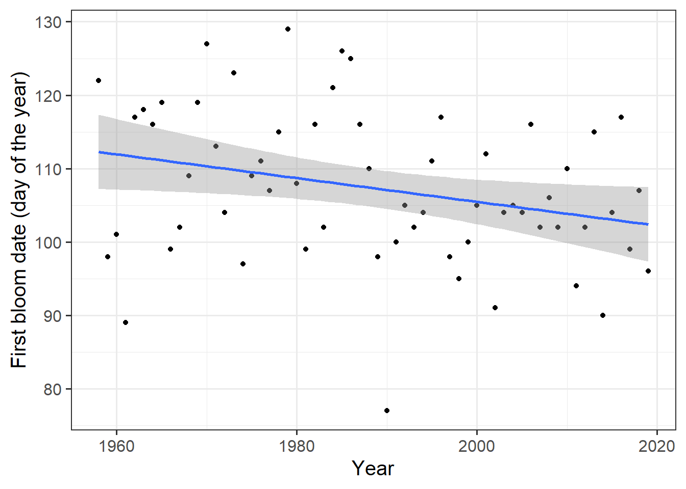
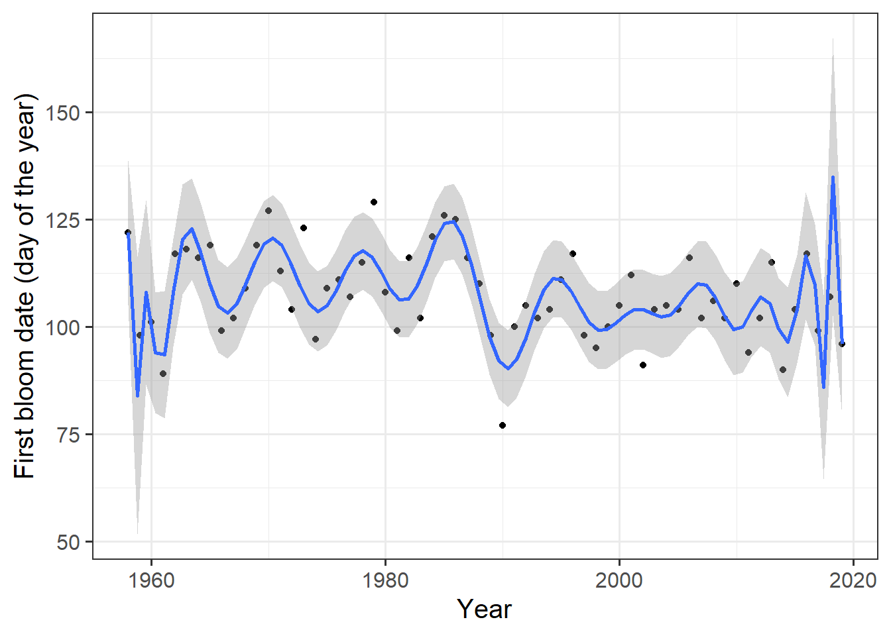

# Simple Phenology Analysis 

## Task 1

**Provide a brief narrative describing what p-hacking is, and why this is a problematic approach to data analysis.**

>
P-hacking refers to the practice of searching through a large dataset for a correlation between data and many variables. Often, a statistically significant correlation is found by chance. Once this correlation is detected, further tests are applied to support the results, indicating a correlation between data and variables. This can create the illusion that new facts have been discovered.
>
This example can also be applied to other areas of agriculture, such as testing a new fungicide. Multiple statistical tests are conducted to investigate whether there is a difference in fungal infection between a plant community treated with the new fungicide and an untreated one. For instance, one test may yield a significant difference between the two groups. Normally, the study would be discontinued and restarted. With P-hacking, additional tests are applied to the data that provided the significant difference to further establish the distinction. In the end, one could conclude that the new fungicide is very effective.

**Overfitting:**

>
Another common problem is overfitting. When data varies greatly, it can be tempting to try and derive a trend. This trend can take several forms. In this example from the lecture, overfitting is demonstrated using blooming data. Initially, the years and the day on which blooming began are related. The following graph shows this.

  

>
The trend line plotted shows that as time progresses, the blooming date is shifted forward. The grey area surrounding the line shows the confidence interval. It can be observed that many values fall outside of the confidence interval, which could be an early indication that the model is not truly representative. The regression model is described by a polynomial. Furthermore, a much more complex regression model is used that employs 25 polynomials. The result shows the following graph.

  

>
A line is seen that describes the observed data very well. The confidence interval also looks very accurate, and most observations fall within it. However, the problem now is that this model is highly likely to only represent the data on which it was created well. If this model were applied to other data, it would not yield an accurate description of the data. This is a classic case of overfitting. 
For more information you can have a look [here](http://inresgb-lehre.iaas.uni-bonn.de/chillR_book/simple_phenology.html#exercises_simple_analysis).

## Task 2

**Provide a sketch of your causal understanding of the relationship between temperature and bloom dates.**

>
To conduct an analysis of the blooming onset, one must fundamentally consider which variables can explain the blooming onset in the first place. The first assumption made here is that the blooming onset depends on time.
>
Time$\longrightarrow$ beginning of flowering*
>
>
Is this really meaningful? Of course not. As described in detail in the lecture, there is a strong correlation between temperature and the onset of blooming.
>
>
Temperature $\longrightarrow$ beginning of flowering*
>
>
Therefore, one should always consider what follows from what? Now, various considerations can be made about how the onset of blooming and temperature are related. The simplest method to investigate this is to compare average annual temperatures to the date of the respective onset of blooming. This would be very simple. However, it would be better to compare average daily temperatures to the blooming time. Now, however, the problem arises that some days of the year, most likely more or less, have an impact on the onset of blooming. Intuitively, one can assume that temperatures in the summer are likely to have less influence on the onset of blooming than temperatures in the spring. This can also be investigated by relating the individual temperatures for each day to the blooming date. Here, an attempt is now being made to explain a dependent variable (onset of blooming) with a large number of independent variables.

## Task 3

**What do we need to know to build a process-based model from this?**

>
To develop a model that correctly relates temperature data to the blooming time, we initially lack data. First, one can make a further differentiation to the blooming time by assuming that the blooming time depends on chill and "forcing." The "forcing" of the trees begins in spring and depends on day length and temperature. Before the trees can "force," they must first experience a certain amount of "chill." These processes are quite complex. In order to make sound statements about the onset of blooming, these phases need to be better understood and more data is needed. The lecture particularly mentions temperature response curves of these phases.

